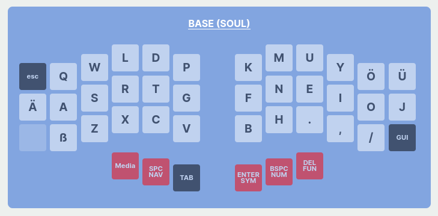
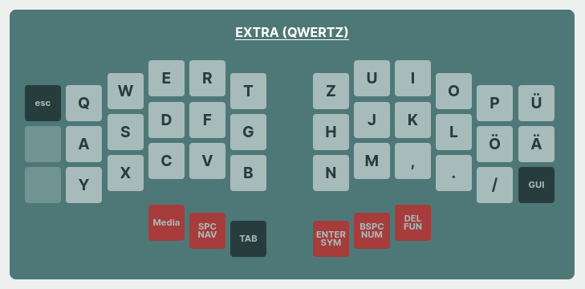
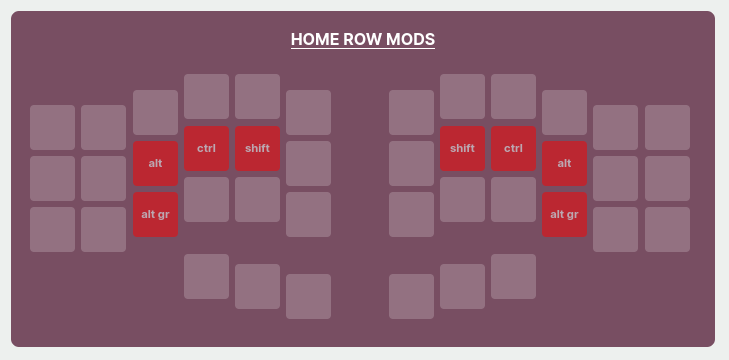
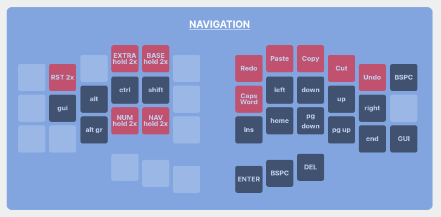
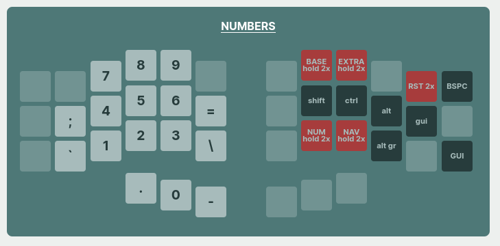
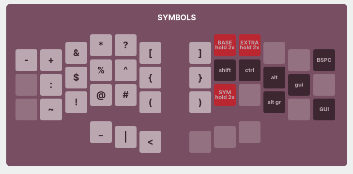
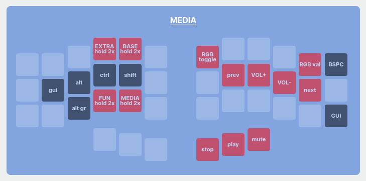
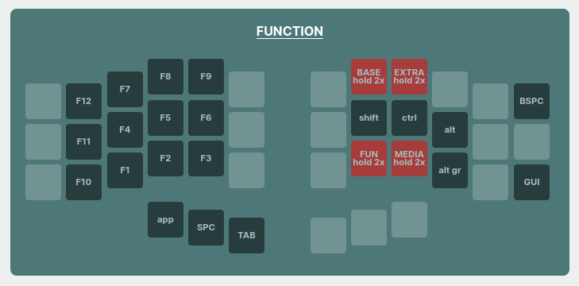

# The Seelen Corne

This is a Corne keyboard layout inspired by Miryoku but tweaked for the [Soul layout](https://kennetchaz.github.io/symmetric-typing/soul.html) 
but to be used with a standard german keyboard layout (on OS level).

These are the layers:

The layer images are created with [Keyfab](https://jaroslaw-weber.github.io/keyfab)
